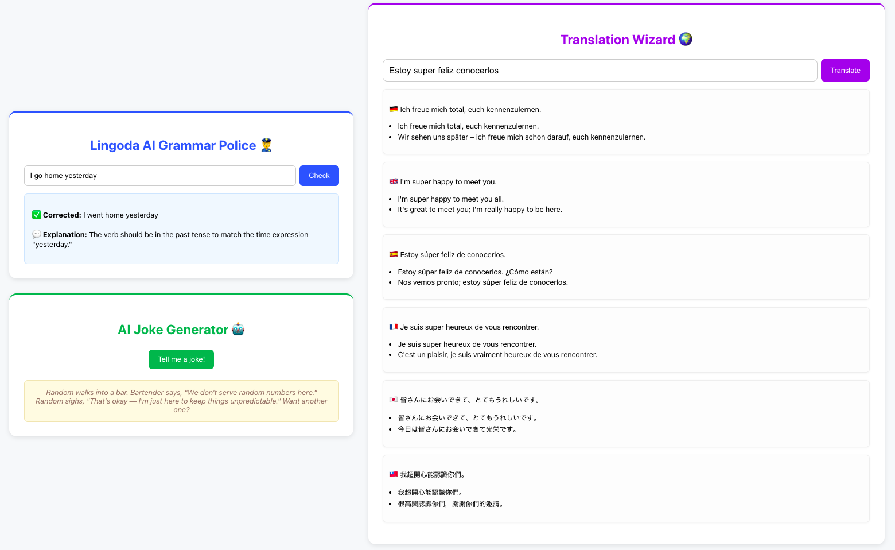

# 🤖 AI Language Assistant

A full-stack web app that uses the **OpenAI ChatGPT SDK** with **FastAPI**, **React** and \*_MongoDB_ to:

1. ✏️ Correct your grammar and explain the changes
2. 😂 Tell you a random AI-generated joke
3. 🧐 Translate your text into six languages

Built with ❤️ using **FastAPI**, **OpenAI SDK**, and **React**.

---

## Preview



---

## 🧠 Features

- ✍️ Grammar correction with explanations
- 🌍 Translations (DE / EN / ES / FR / JP / TW) + examples
- 🤖 AI joke generator
- 🧱 MongoDB integration for history logging
- ⚡ FastAPI backend + React frontend
- 🔐 Environment variables via `.env`
- 🧰 Pipenv for dependency & Python version management

---

## 🧩 Tech Stack

| Layer          | Technology        |
| -------------- | ----------------- |
| Frontend       | React + Fetch API |
| Backend        | FastAPI           |
| AI Integration | OpenAI Python SDK |
| Styling        | Plain CSS         |
| Database       | MongoDB.          |

---

## 📁 Project Structure

```
chat-gpt/
├── backend/
│ ├── main.py # FastAPI entrypoint
│ ├── db.py # MongoDB (Motor) connection
│ ├── .env # Environment variables (not committed)
│ ├── Pipfile
│ └── Pipfile.lock
│
├── frontend/
│ ├── src/
│ │ ├── App.js
│ │ ├── App.css
│ ├── package.json
│
└── README.md
```

---

## ⚙️ Backend Setup (FastAPI)

### 1. Create and activate a virtual environment

```bash
cd backend
python3 -m venv venv
source venv/bin/activate    # (Mac/Linux)
venv\Scripts\activate       # (Windows)
```

### 2. Install dependencies & run virtual environment

```bash
pipenv install
pipenv shell
```

### 3. Create .env file

```
OPENAI_API_KEY=sk-...
MONGO_URI=mongodb+srv://<user>:<password>@cluster0.mongodb.net/?retryWrites=true&w=majority
MONGO_DB=chat-gpt
FASTAPI_PORT=8080
```

### 4. Run the backend

```bash
make start
```

---

## 💻 Frontend Setup (React + Webpack)

### 1. Navigate to the frontend directory

```bash
cd ../frontend
```

### 2. Install dependencies

```bash
npm install
```

### 3. Run the frontend

```bash
npm start
```

### 4. Open your browser

Visit `http://localhost:3000` to access the app.
